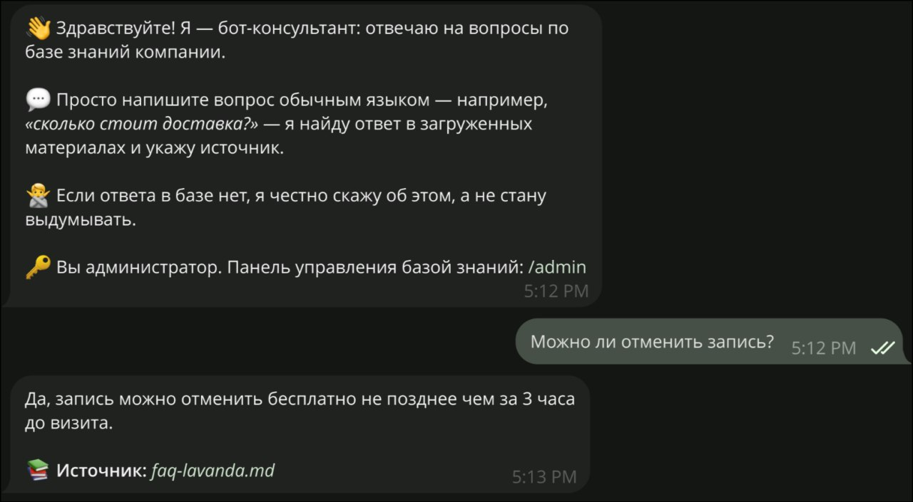
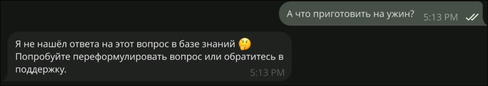
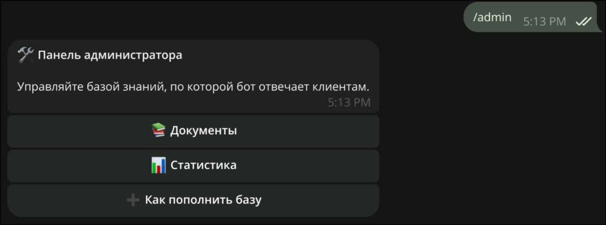
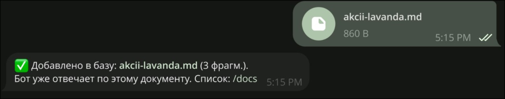
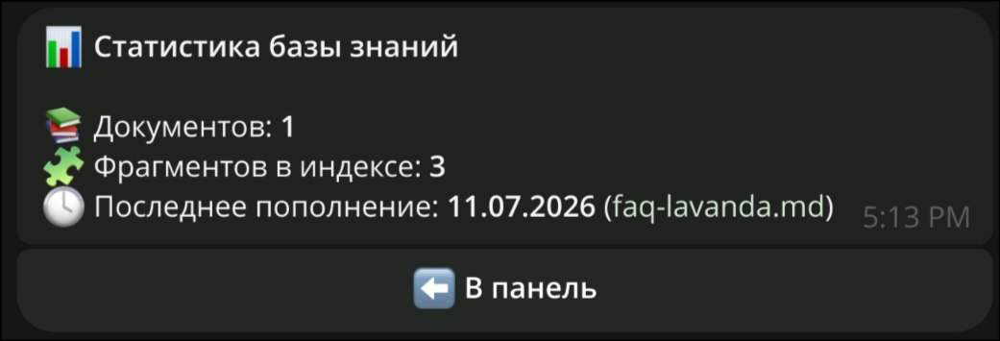

# RAG FAQ Bot - Telegram support bot for your knowledge base

**English** | [Русский](README.ru.md)

A Telegram bot that answers customers **from your own knowledge base** - upload your
FAQ, price list or docs, and the bot replies using Retrieval-Augmented Generation:
it finds the relevant passages and answers **grounded in them, with the source**,
instead of making things up. If the answer isn't in your materials, it says so and
points to support rather than hallucinating.

Built on aiogram 3 and powered by [**pgvector-rag**](https://github.com/xvin84/pgvector-rag) -
my own open-source RAG toolkit - over PostgreSQL + pgvector.

## Features

**For customers**
- Ask a question in plain language → get an answer drawn from the knowledge base,
  with the source document named.
- No relevant info? The bot admits it and suggests contacting support - it never
  invents an answer.

**For the owner (admin)**
- Send a `.txt` / `.md` file → the bot chunks, embeds and indexes it. The filename
  becomes the source label. Swap or extend the knowledge base anytime.
- `/docs` → see every indexed document (chunk count, date added) and delete an
  outdated one with a single tap.

## What it looks like

Ask in plain language - the answer comes from the knowledge base, with the source
named. Off-base questions get an honest "I don't have that" instead of a
hallucination:





The owner manages the base right in the chat - an inline admin panel, base stats
and one-message document ingestion:

| Admin panel | Uploading a document |
| --- | --- |
|  |  |



## Stack

Python 3.12 · aiogram 3 · [pgvector-rag](https://github.com/xvin84/pgvector-rag) ·
**PostgreSQL + pgvector** · OpenAI (embeddings + chat) · asyncpg · pytest.

## How it works

1. **Ingest.** An uploaded document is split into passages (heading-aware chunking),
   each embedded and stored in pgvector - all via the `pgvector-rag` library.
2. **Retrieve.** A question is embedded and matched against the base by cosine
   similarity; only passages above a relevance threshold come back.
3. **Ground.** The retrieved passages become the context; the model is instructed to
   answer *only* from them ([`services/answer.py`](services/answer.py)). No hits →
   a fixed "I don't have that" reply, and the model isn't even called.

The grounding and source logic are pure functions, unit-tested without OpenAI or a
database.

## Run locally

```bash
docker compose up -d                 # PostgreSQL + pgvector
cp .env.example .env                 # set BOT_TOKEN, ADMIN_IDS, OPENAI_API_KEY
uv sync
uv run python main.py
```

Then, as an admin, send the bot a `.txt` or `.md` file with your FAQ/docs, and start
asking questions. `OPENAI_BASE_URL` can point at a proxy aggregator where
`api.openai.com` is blocked.

## Tests

```bash
uv run pytest        # grounding & source logic, no OpenAI or database needed
```

## License

[MIT](LICENSE)
